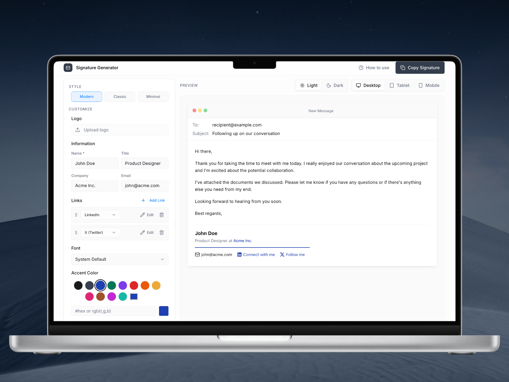
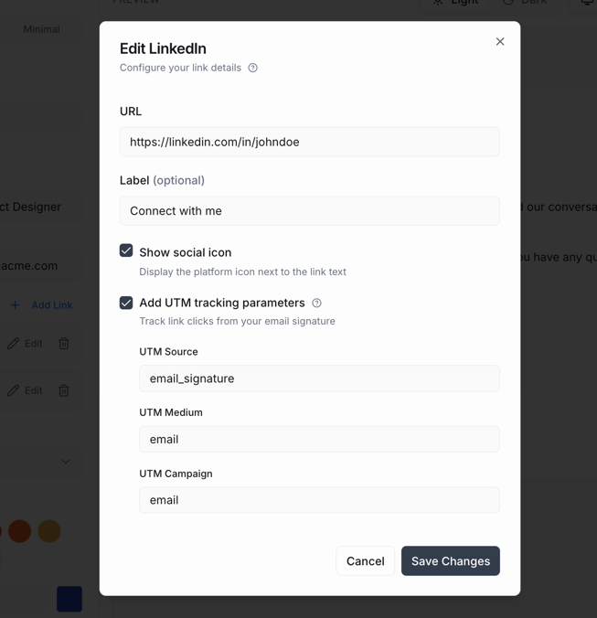
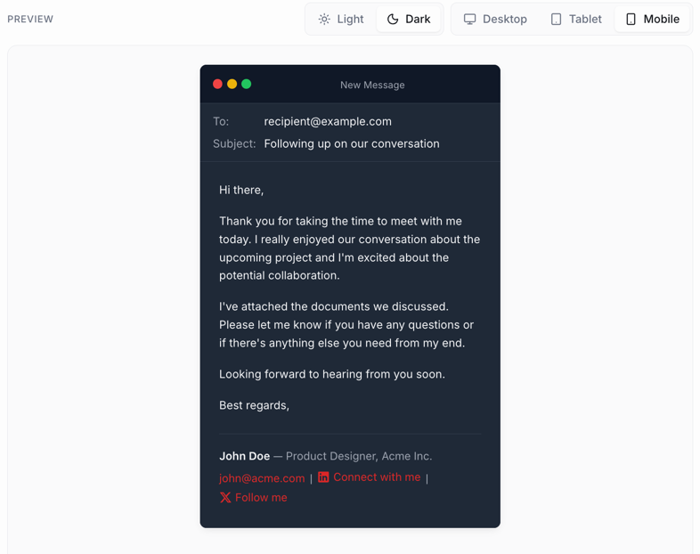

# Email Signature Generator

A professional email signature generator built with modern web technologies.

<div align="center">


</div>



| Social Link Editor                                   | Preview Email Options                                |
|------------------------------------------------------|------------------------------------------------------|
|  |  |

---

## ✨ Features

- **3 different signature styles** to choose from: Classic, Modern, and Minimalist.
- **Customizable fields** including name, job title, company, email, and social media links.
- **Highly customizable social links** with options for icons, labels, optional UTM parameters, and ordering via
  drag-and-drop.
- **Logo upload support** with size customization.
- **Font style** customization with a selection of web-safe fonts.
- **Accent color** customization to match your brand.
- **Live preview** of the signature as you customize it, with theme support (light/dark), and screen size
  responsiveness.
- **Copy to clipboard** functionality for easy signature insertion.
- **Share signature** via a unique URL that encodes the signature data, allowing others to view and copy it without
  needing to recreate it from scratch.

> **Note**: _This does not include a logo image upload feature, since that would require backend support.

---

## 🚀 Getting Started

First, install the dependencies:

```bash
npm install
```

Then, run the development server:

```bash
npm run dev
```

Open [http://localhost:8080](zhttp://localhost:8080) with your browser to see the result.

---

## ▲ Deployment

The fastest way to deploy this app is via [Vercel](https://vercel.com) — simply connect your repository and deploy.

For more options, check out the [Vite deployment guide](https://vitejs.dev/guide/static-deploy.html).

> **Note:** You can deploy this app on any platform that supports static sites, such
> as [Netlify](https://www.netlify.com), [GitHub Pages](https://pages.github.com), [Render](https://render.com),
> or [Cloudflare Pages](https://pages.cloudflare.com).

---

## 🛠 Tech Stack

- [Vite](https://vitejs.dev) - Build tool
- [React](https://react.dev) - UI framework
- [TypeScript](https://www.typescriptlang.org) - Type safety
- [Tailwind CSS](https://tailwindcss.com) - Styling
- [shadcn/ui](https://ui.shadcn.com) - UI components

---

## 🤝 Contributing

Contributions are welcome! Please open an issue or submit a pull request for any improvements or bug fixes.

Note that for code quality, we rely on the following tools:

- [ESLint](https://eslint.org) - Linting
- [Prettier](https://prettier.io) - Code formatting

---

## 📄 License

This project is licensed under the MIT License. See the [LICENSE](LICENSE) file for details.
